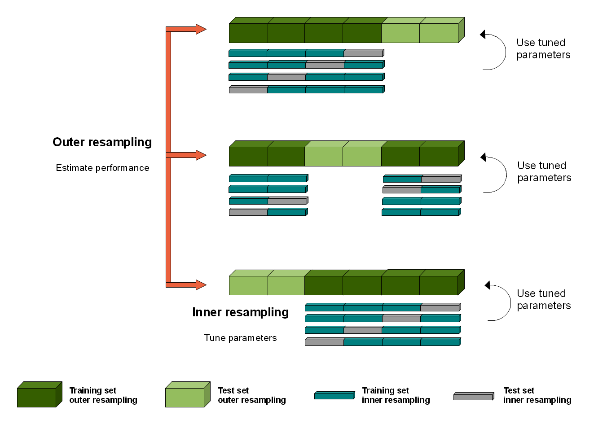

## Nested Resampling {#nested-resampling}

In order to obtain unbiased performance estimates for learners, all parts of the model building (preprocessing and model selection steps) should be included in the resampling, i.e., repeated for every pair of training/test data.
For steps that themselves require resampling like hyperparameter tuning or feature-selection (via the wrapper approach) this results in two nested resampling loops.



The graphic above illustrates nested resampling for parameter tuning with 3-fold cross-validation in the outer and 4-fold cross-validation in the inner loop.

In the outer resampling loop, we have three pairs of training/test sets.
On each of these outer training sets parameter tuning is done, thereby executing the inner resampling loop.
This way, we get one set of selected hyperparameters for each outer training set.
Then the learner is fitted on each outer training set using the corresponding selected hyperparameters.
Subsequently, we can evaluate the performance of the learner on the outer test sets.

In [mlr3](https://mlr3.mlr-org.com), you can run nested resampling for free without programming any loops by using the [`mlr3tuning::AutoTuner`](https://mlr3tuning.mlr-org.com/reference/AutoTuner.html) class.
This works as follows:

1. Generate a wrapped Learner via class [`mlr3tuning::AutoTuner`](https://mlr3tuning.mlr-org.com/reference/AutoTuner.html) or `mlr3filters::AutoSelect` (not yet implemented).
2. Specify all required settings - see section ["Automating the Tuning"](#autotuner) for help.
3. Call function [`resample()`](https://mlr3.mlr-org.com/reference/resample.html) or [`benchmark()`](https://mlr3.mlr-org.com/reference/benchmark.html) with the created [`Learner`](https://mlr3.mlr-org.com/reference/Learner.html).

You can freely combine different inner and outer resampling strategies.

A common setup is prediction and performance evaluation on a fixed outer test set.
This can be achieved by passing the [`Resampling`](https://mlr3.mlr-org.com/reference/Resampling.html) strategy (`rsmp("holdout")`) as the outer resampling instance to either [`resample()`](https://mlr3.mlr-org.com/reference/resample.html) or [`benchmark()`](https://mlr3.mlr-org.com/reference/benchmark.html).

The inner resampling strategy could be a cross-validation one (`rsmp("cv")`) as the sizes of the outer training sets might differ.
Per default, the inner resample description is instantiated once for every outer training set.

Note that nested resampling is computationally expensive.
For this reason we use relatively small search spaces and a low number of resampling iterations in the examples shown below.
In practice, you normally have to increase both.
As this is computationally intensive you might want to have a look at the section on [Parallelization](#parallelization).

### Execution {#nested-resamp-exec}

To optimize hyperparameters or conduct feature selection in a nested resampling you need to create learners using either:

* the [`AutoTuner`](https://mlr3tuning.mlr-org.com/reference/AutoTuner.html) class, or
* the `mlr3filters::AutoSelect` class (not yet implemented)

We use the example from section ["Automating the Tuning"](#autotuner) and pipe the resulting learner into a [`resample()`](https://mlr3.mlr-org.com/reference/resample.html) call.


```r
library("mlr3tuning")
task = tsk("iris")
learner = lrn("classif.rpart")
resampling = rsmp("holdout")
measure = msr("classif.ce")
search_space = paradox::ParamSet$new(
  params = list(paradox::ParamDbl$new("cp", lower = 0.001, upper = 0.1)))
terminator = trm("evals", n_evals = 5)
tuner = tnr("grid_search", resolution = 10)

at = AutoTuner$new(
  learner = learner,
  resampling = resampling,
  measure = measure,
  search_space = search_space,
  terminator = terminator,
  tuner = tuner
)
```

Now construct the [`resample()`](https://mlr3.mlr-org.com/reference/resample.html) call:


```r
resampling_outer = rsmp("cv", folds = 3)
rr = resample(task = task, learner = at, resampling = resampling_outer)
```

```
## INFO  [15:43:51.339] Starting to optimize 1 parameter(s) with '<OptimizerGridSearch>' and '<TerminatorEvals>' 
## INFO  [15:43:51.389] Evaluating 1 configuration(s) 
## INFO  [15:43:51.578] Result of batch 1: 
## INFO  [15:43:51.582]   cp classif.ce                                uhash 
## INFO  [15:43:51.582]  0.1    0.09091 43d37541-0e43-4468-a391-50c46dbec58c 
## INFO  [15:43:51.585] Evaluating 1 configuration(s) 
## INFO  [15:43:51.810] Result of batch 2: 
## INFO  [15:43:51.813]     cp classif.ce                                uhash 
## INFO  [15:43:51.813]  0.034    0.09091 0d56410d-fb70-420a-8ad4-c11020046c2f 
## INFO  [15:43:51.816] Evaluating 1 configuration(s) 
## INFO  [15:43:51.949] Result of batch 3: 
## INFO  [15:43:51.952]     cp classif.ce                                uhash 
## INFO  [15:43:51.952]  0.089    0.09091 eb882957-f49a-476c-92a8-2419ba319f95 
## INFO  [15:43:51.957] Evaluating 1 configuration(s) 
## INFO  [15:43:52.081] Result of batch 4: 
## INFO  [15:43:52.084]     cp classif.ce                                uhash 
## INFO  [15:43:52.084]  0.078    0.09091 41b6b0e8-9cbd-48f5-b68d-96f318801aa7 
## INFO  [15:43:52.087] Evaluating 1 configuration(s) 
## INFO  [15:43:52.205] Result of batch 5: 
## INFO  [15:43:52.208]     cp classif.ce                                uhash 
## INFO  [15:43:52.208]  0.045    0.09091 aab37855-4e23-49f2-b43c-760e114a9c8f 
## INFO  [15:43:52.218] Finished optimizing after 5 evaluation(s) 
## INFO  [15:43:52.219] Result: 
## INFO  [15:43:52.222]   cp learner_param_vals  x_domain classif.ce 
## INFO  [15:43:52.222]  0.1          <list[2]> <list[1]>    0.09091 
## INFO  [15:43:52.360] Starting to optimize 1 parameter(s) with '<OptimizerGridSearch>' and '<TerminatorEvals>' 
## INFO  [15:43:52.365] Evaluating 1 configuration(s) 
## INFO  [15:43:52.474] Result of batch 1: 
## INFO  [15:43:52.477]     cp classif.ce                                uhash 
## INFO  [15:43:52.477]  0.045    0.06061 ec0f8440-54cc-4f69-b9cc-ca461e734c25 
## INFO  [15:43:52.479] Evaluating 1 configuration(s) 
## INFO  [15:43:52.592] Result of batch 2: 
## INFO  [15:43:52.595]     cp classif.ce                                uhash 
## INFO  [15:43:52.595]  0.056    0.06061 26972024-909a-4acb-8e33-df4c1150177d 
## INFO  [15:43:52.598] Evaluating 1 configuration(s) 
## INFO  [15:43:52.723] Result of batch 3: 
## INFO  [15:43:52.726]     cp classif.ce                                uhash 
## INFO  [15:43:52.726]  0.089    0.06061 531d9e76-dd4e-402a-8248-38dca5dd8dab 
## INFO  [15:43:52.728] Evaluating 1 configuration(s) 
## INFO  [15:43:52.834] Result of batch 4: 
## INFO  [15:43:52.837]   cp classif.ce                                uhash 
## INFO  [15:43:52.837]  0.1    0.06061 78ad05f7-027e-4c9a-8c5b-c4374123e7bf 
## INFO  [15:43:52.840] Evaluating 1 configuration(s) 
## INFO  [15:43:52.955] Result of batch 5: 
## INFO  [15:43:52.957]     cp classif.ce                                uhash 
## INFO  [15:43:52.957]  0.023    0.06061 c279e4b8-382b-453c-a31b-aeaeed65d8df 
## INFO  [15:43:52.964] Finished optimizing after 5 evaluation(s) 
## INFO  [15:43:52.966] Result: 
## INFO  [15:43:52.968]     cp learner_param_vals  x_domain classif.ce 
## INFO  [15:43:52.968]  0.045          <list[2]> <list[1]>    0.06061 
## INFO  [15:43:53.040] Starting to optimize 1 parameter(s) with '<OptimizerGridSearch>' and '<TerminatorEvals>' 
## INFO  [15:43:53.045] Evaluating 1 configuration(s) 
## INFO  [15:43:53.162] Result of batch 1: 
## INFO  [15:43:53.165]     cp classif.ce                                uhash 
## INFO  [15:43:53.165]  0.078    0.09091 548b0c4e-4245-4871-bb73-5082001ab545 
## INFO  [15:43:53.168] Evaluating 1 configuration(s) 
## INFO  [15:43:53.292] Result of batch 2: 
## INFO  [15:43:53.295]     cp classif.ce                                uhash 
## INFO  [15:43:53.295]  0.056    0.09091 9d4b4b5b-2345-4658-a934-c55de3889f21 
## INFO  [15:43:53.299] Evaluating 1 configuration(s) 
## INFO  [15:43:53.419] Result of batch 3: 
## INFO  [15:43:53.422]   cp classif.ce                                uhash 
## INFO  [15:43:53.422]  0.1    0.09091 7cb780c5-b845-4fb4-9b75-ac0af91011f9 
## INFO  [15:43:53.425] Evaluating 1 configuration(s) 
## INFO  [15:43:53.549] Result of batch 4: 
## INFO  [15:43:53.552]     cp classif.ce                                uhash 
## INFO  [15:43:53.552]  0.067    0.09091 58375fb7-e737-40da-9ff5-1ec471271557 
## INFO  [15:43:53.555] Evaluating 1 configuration(s) 
## INFO  [15:43:53.674] Result of batch 5: 
## INFO  [15:43:53.677]     cp classif.ce                                uhash 
## INFO  [15:43:53.677]  0.012    0.09091 f2ac3e91-5501-46e6-8825-7175d7e89aa4 
## INFO  [15:43:53.685] Finished optimizing after 5 evaluation(s) 
## INFO  [15:43:53.687] Result: 
## INFO  [15:43:53.689]     cp learner_param_vals  x_domain classif.ce 
## INFO  [15:43:53.689]  0.078          <list[2]> <list[1]>    0.09091
```

### Evaluation {#nested-resamp-eval}

With the created [`ResampleResult`](https://mlr3.mlr-org.com/reference/ResampleResult.html) we can now inspect the executed resampling iterations more closely.
See the section on [Resampling](#resampling) for more detailed information about [`ResampleResult`](https://mlr3.mlr-org.com/reference/ResampleResult.html) objects.

For example, we can query the aggregated performance result:


```r
rr$aggregate()
```

```
## classif.ce 
##    0.07333
```

Check for any errors in the folds during execution (if there is not output, warnings or errors recorded, this is an empty `data.table()`:


```r
rr$errors
```

```
## Empty data.table (0 rows and 2 cols): iteration,msg
```

Or take a look at the confusion matrix of the joined predictions:


```r
rr$prediction()$confusion
```

```
##             truth
## response     setosa versicolor virginica
##   setosa         50          0         0
##   versicolor      0         47         8
##   virginica       0          3        42
```
