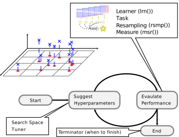

## Hyperparameter Tuning {#tuning}


Hyperparameters are second-order parameters of machine learning models that, while often not explicitly optimized during the model estimation process, can have an important impact on the outcome and predictive performance of a model.
Typically, hyperparameters are fixed before training a model.
However, because the output of a model can be sensitive to the specification of hyperparameters, it is often recommended to make an informed decision about which hyperparameter settings may yield better model performance.
In many cases, hyperparameter settings may be chosen _a priori_, but it can be advantageous to try different settings before fitting your model on the training data.
This process is often called model 'tuning'.

Hyperparameter tuning is supported via the [mlr3tuning](https://mlr3tuning.mlr-org.com) extension package.
Below you can find an illustration of the process:



At the heart of [mlr3tuning](https://mlr3tuning.mlr-org.com) are the R6 classes:

* [`TuningInstanceSingleCrit`](https://mlr3tuning.mlr-org.com/reference/TuningInstanceSingleCrit.html), [`TuningInstanceMultiCrit`](https://mlr3tuning.mlr-org.com/reference/TuningInstanceMultiCrit.html): These two classes describe the tuning problem and store the results.
* [`Tuner`](https://mlr3tuning.mlr-org.com/reference/Tuner.html): This class is the base class for implementations of tuning algorithms.

### The `TuningInstance*` Classes {#tuning-optimization}

The following sub-section examines the optimization of a simple classification tree on the [`Pima Indian Diabetes`](https://mlr3.mlr-org.com/reference/mlr_tasks_pima.html) data set.


```r
task = tsk("pima")
print(task)
```

```
## <TaskClassif:pima> (768 x 9)
## * Target: diabetes
## * Properties: twoclass
## * Features (8):
##   - dbl (8): age, glucose, insulin, mass, pedigree, pregnant, pressure,
##     triceps
```

We use the classification tree from [rpart](https://cran.r-project.org/package=rpart) and choose a subset of the hyperparameters we want to tune.
This is often referred to as the "tuning space".


```r
learner = lrn("classif.rpart")
learner$param_set
```

```
## <ParamSet>
##                 id    class lower upper      levels        default value
##  1:       minsplit ParamInt     1   Inf                         20      
##  2:      minbucket ParamInt     1   Inf             <NoDefault[3]>      
##  3:             cp ParamDbl     0     1                       0.01      
##  4:     maxcompete ParamInt     0   Inf                          4      
##  5:   maxsurrogate ParamInt     0   Inf                          5      
##  6:       maxdepth ParamInt     1    30                         30      
##  7:   usesurrogate ParamInt     0     2                          2      
##  8: surrogatestyle ParamInt     0     1                          0      
##  9:           xval ParamInt     0   Inf                         10     0
## 10:     keep_model ParamLgl    NA    NA  TRUE,FALSE          FALSE
```

Here, we opt to tune two parameters:

* The complexity `cp`
* The termination criterion `minsplit`

The tuning space needs to be bounded, therefore one has to set lower and upper bounds:


```r
library("paradox")
tune_ps = ParamSet$new(list(
  ParamDbl$new("cp", lower = 0.001, upper = 0.1),
  ParamInt$new("minsplit", lower = 1, upper = 10)
))
tune_ps
```

```
## <ParamSet>
##          id    class lower upper levels        default value
## 1:       cp ParamDbl 0.001   0.1        <NoDefault[3]>      
## 2: minsplit ParamInt 1.000  10.0        <NoDefault[3]>
```

Next, we need to specify how to evaluate the performance.
For this, we need to choose a [`resampling strategy`](https://mlr3.mlr-org.com/reference/Resampling.html) and a [`performance measure`](https://mlr3.mlr-org.com/reference/Measure.html).


```r
hout = rsmp("holdout")
measure = msr("classif.ce")
```

Finally, one has to select the budget available, to solve this tuning instance.
This is done by selecting one of the available [`Terminators`](https://bbotk.mlr-org.com/reference/Terminator.html):

* Terminate after a given time ([`TerminatorClockTime`](https://bbotk.mlr-org.com/reference/mlr_terminators_clock_time.html))
* Terminate after a given amount of iterations ([`TerminatorEvals`](https://bbotk.mlr-org.com/reference/mlr_terminators_evals.html))
* Terminate after a specific performance is reached ([`TerminatorPerfReached`](https://bbotk.mlr-org.com/reference/mlr_terminators_perf_reached.html))
* Terminate when tuning does not improve ([`TerminatorStagnation`](https://bbotk.mlr-org.com/reference/mlr_terminators_stagnation.html))
* A combination of the above in an *ALL* or *ANY* fashion ([`TerminatorCombo`](https://bbotk.mlr-org.com/reference/mlr_terminators_combo.html))

For this short introduction, we specify a budget of 20 evaluations and then put everything together into a [`TuningInstanceSingleCrit`](https://mlr3tuning.mlr-org.com/reference/TuningInstanceSingleCrit.html):


```r
library("mlr3tuning")

evals20 = trm("evals", n_evals = 20)

instance = TuningInstanceSingleCrit$new(
  task = task,
  learner = learner,
  resampling = hout,
  measure = measure,
  search_space = tune_ps,
  terminator = evals20
)
instance
```

```
## <TuningInstanceSingleCrit>
## * State:  Not optimized
## * Objective: <ObjectiveTuning:classif.rpart_on_pima>
## * Search Space:
## <ParamSet>
##          id    class lower upper levels        default value
## 1:       cp ParamDbl 0.001   0.1        <NoDefault[3]>      
## 2: minsplit ParamInt 1.000  10.0        <NoDefault[3]>      
## * Terminator: <TerminatorEvals>
## * Terminated: FALSE
## * Archive:
## <ArchiveTuning>
## Null data.table (0 rows and 0 cols)
```

To start the tuning, we still need to select how the optimization should take place.
In other words, we need to choose the **optimization algorithm** via the [`Tuner`](https://mlr3tuning.mlr-org.com/reference/Tuner.html) class.

### The `Tuner` Class

The following algorithms are currently implemented in [mlr3tuning](https://mlr3tuning.mlr-org.com):

* Grid Search ([`TunerGridSearch`](https://mlr3tuning.mlr-org.com/reference/mlr_tuners_grid_search.html))
* Random Search ([`TunerRandomSearch`](https://mlr3tuning.mlr-org.com/reference/mlr_tuners_random_search.html)) [@bergstra2012]
* Generalized Simulated Annealing ([`TunerGenSA`](https://mlr3tuning.mlr-org.com/reference/mlr_tuners_gensa.html))
* Non-Linear Optimization ([`TunerNLoptr`](https://mlr3tuning.mlr-org.com/reference/mlr_tuners_nloptr.html))

In this example, we will use a simple grid search with a grid resolution of 5.


```r
tuner = tnr("grid_search", resolution = 5)
```

Since we have only numeric parameters, [`TunerGridSearch`](https://mlr3tuning.mlr-org.com/reference/mlr_tuners_grid_search.html) will create an equidistant grid between the respective upper and lower bounds.
As we have two hyperparameters with a resolution of 5, the two-dimensional grid consists of $5^2 = 25$ configurations.
Each configuration serves as a hyperparameter setting for the previously defined [`Learner`](https://mlr3.mlr-org.com/reference/Learner.html) and triggers a 3-fold cross validation on the task.
All configurations will be examined by the tuner (in a random order), until either all configurations are evaluated or the [`Terminator`](https://bbotk.mlr-org.com/reference/Terminator.html) signals that the budget is exhausted.

### Triggering the Tuning {#tuning-triggering}

To start the tuning, we simply pass the [`TuningInstanceSingleCrit`](https://mlr3tuning.mlr-org.com/reference/TuningInstanceSingleCrit.html) to the `$optimize()` method of the initialized [`Tuner`](https://mlr3tuning.mlr-org.com/reference/Tuner.html).
The tuner proceeds as follows:

1. The [`Tuner`](https://mlr3tuning.mlr-org.com/reference/Tuner.html) proposes at least one hyperparameter configuration (the [`Tuner`](https://mlr3tuning.mlr-org.com/reference/Tuner.html) may propose multiple points to improve parallelization, which can be controlled via the setting `batch_size`).
2. For each configuration, the given [`Learner`](https://mlr3.mlr-org.com/reference/Learner.html) is fitted on the [`Task`](https://mlr3.mlr-org.com/reference/Task.html) using the provided [`Resampling`](https://mlr3.mlr-org.com/reference/Resampling.html).
   All evaluations are stored in the archive of the [`TuningInstanceSingleCrit`](https://mlr3tuning.mlr-org.com/reference/TuningInstanceSingleCrit.html).
3. The [`Terminator`](https://bbotk.mlr-org.com/reference/Terminator.html) is queried if the budget is exhausted.
   If the budget is not exhausted, restart with 1) until it is.
4. Determine the configuration with the best observed performance.
5. Store the best configurations as result in the instance object.
   The best hyperparameter settings (`$result_learner_param_vals`) and the corresponding measured performance (`$result_y`) can be accessed from the instance.


```r
tuner$optimize(instance)
```

```
## INFO  [15:43:41.585] Starting to optimize 2 parameter(s) with '<OptimizerGridSearch>' and '<TerminatorEvals>' 
## INFO  [15:43:41.635] Evaluating 1 configuration(s) 
## INFO  [15:43:41.946] Result of batch 1: 
## INFO  [15:43:41.949]   cp minsplit classif.ce                                uhash 
## INFO  [15:43:41.949]  0.1        8     0.2617 b00eb5b0-92e7-44bd-b67b-a3544a151c07 
## INFO  [15:43:41.952] Evaluating 1 configuration(s) 
## INFO  [15:43:42.177] Result of batch 2: 
## INFO  [15:43:42.180]       cp minsplit classif.ce                                uhash 
## INFO  [15:43:42.180]  0.07525        8     0.2617 c149887b-e1e4-43b4-948b-d17889b54b23 
## INFO  [15:43:42.184] Evaluating 1 configuration(s) 
## INFO  [15:43:42.322] Result of batch 3: 
## INFO  [15:43:42.326]   cp minsplit classif.ce                                uhash 
## INFO  [15:43:42.326]  0.1        5     0.2617 48162c05-c8d3-478b-901f-a9123a841901 
## INFO  [15:43:42.329] Evaluating 1 configuration(s) 
## INFO  [15:43:42.453] Result of batch 4: 
## INFO  [15:43:42.456]      cp minsplit classif.ce                                uhash 
## INFO  [15:43:42.456]  0.0505       10     0.2617 fef6950e-d420-4a96-a9cd-ae000d96cd00 
## INFO  [15:43:42.459] Evaluating 1 configuration(s) 
## INFO  [15:43:42.577] Result of batch 5: 
## INFO  [15:43:42.580]       cp minsplit classif.ce                                uhash 
## INFO  [15:43:42.580]  0.02575       10     0.2148 a18cb578-1b38-40f5-ad2e-7145736f6f56 
## INFO  [15:43:42.584] Evaluating 1 configuration(s) 
## INFO  [15:43:42.706] Result of batch 6: 
## INFO  [15:43:42.709]       cp minsplit classif.ce                                uhash 
## INFO  [15:43:42.709]  0.02575        3     0.2148 a61c5fe9-5eb8-41dd-be10-395d01ea2b02 
## INFO  [15:43:42.712] Evaluating 1 configuration(s) 
## INFO  [15:43:42.830] Result of batch 7: 
## INFO  [15:43:42.833]      cp minsplit classif.ce                                uhash 
## INFO  [15:43:42.833]  0.0505        1     0.2617 f824e5d5-6efc-422d-a997-4a7a02aacdb1 
## INFO  [15:43:42.836] Evaluating 1 configuration(s) 
## INFO  [15:43:42.958] Result of batch 8: 
## INFO  [15:43:42.961]       cp minsplit classif.ce                                uhash 
## INFO  [15:43:42.961]  0.07525        5     0.2617 4a0625f7-898a-43df-89bc-f8f44e2ea766 
## INFO  [15:43:42.964] Evaluating 1 configuration(s) 
## INFO  [15:43:43.092] Result of batch 9: 
## INFO  [15:43:43.095]   cp minsplit classif.ce                                uhash 
## INFO  [15:43:43.095]  0.1       10     0.2617 50bb954b-43b4-4886-abff-8991ff7c004b 
## INFO  [15:43:43.098] Evaluating 1 configuration(s) 
## INFO  [15:43:43.218] Result of batch 10: 
## INFO  [15:43:43.221]       cp minsplit classif.ce                                uhash 
## INFO  [15:43:43.221]  0.02575        1     0.2148 bc7b2dd3-72ea-4b0c-a2f8-b3806a40e69d 
## INFO  [15:43:43.224] Evaluating 1 configuration(s) 
## INFO  [15:43:43.343] Result of batch 11: 
## INFO  [15:43:43.346]       cp minsplit classif.ce                                uhash 
## INFO  [15:43:43.346]  0.07525       10     0.2617 664eee9d-789f-4d4a-b6ff-fac2c09dcc5f 
## INFO  [15:43:43.349] Evaluating 1 configuration(s) 
## INFO  [15:43:43.475] Result of batch 12: 
## INFO  [15:43:43.478]       cp minsplit classif.ce                                uhash 
## INFO  [15:43:43.478]  0.07525        1     0.2617 27e928ab-ded9-4ef0-a0e7-62b4df0b1738 
## INFO  [15:43:43.481] Evaluating 1 configuration(s) 
## INFO  [15:43:43.599] Result of batch 13: 
## INFO  [15:43:43.602]   cp minsplit classif.ce                                uhash 
## INFO  [15:43:43.602]  0.1        3     0.2617 62d36e64-2e51-4e62-894f-26cc215b70cb 
## INFO  [15:43:43.606] Evaluating 1 configuration(s) 
## INFO  [15:43:43.722] Result of batch 14: 
## INFO  [15:43:43.725]     cp minsplit classif.ce                                uhash 
## INFO  [15:43:43.725]  0.001       10     0.2656 fe641c19-992f-4c13-ba6b-e3d7e704ff5f 
## INFO  [15:43:43.727] Evaluating 1 configuration(s) 
## INFO  [15:43:43.851] Result of batch 15: 
## INFO  [15:43:43.855]     cp minsplit classif.ce                                uhash 
## INFO  [15:43:43.855]  0.001        5     0.2656 270e3197-7bc5-4a57-b862-7e53079ec4cc 
## INFO  [15:43:43.858] Evaluating 1 configuration(s) 
## INFO  [15:43:43.981] Result of batch 16: 
## INFO  [15:43:43.984]      cp minsplit classif.ce                                uhash 
## INFO  [15:43:43.984]  0.0505        8     0.2617 45a2c931-39f3-4bfe-bbd6-b2c14df38b4f 
## INFO  [15:43:43.987] Evaluating 1 configuration(s) 
## INFO  [15:43:44.114] Result of batch 17: 
## INFO  [15:43:44.121]       cp minsplit classif.ce                                uhash 
## INFO  [15:43:44.121]  0.02575        8     0.2148 9cb608bc-6211-4f79-abf0-be14e1304bf2 
## INFO  [15:43:44.128] Evaluating 1 configuration(s) 
## INFO  [15:43:44.260] Result of batch 18: 
## INFO  [15:43:44.263]   cp minsplit classif.ce                                uhash 
## INFO  [15:43:44.263]  0.1        1     0.2617 d61846fd-8a23-4ded-9c86-19fc4a149439 
## INFO  [15:43:44.266] Evaluating 1 configuration(s) 
## INFO  [15:43:44.386] Result of batch 19: 
## INFO  [15:43:44.390]      cp minsplit classif.ce                                uhash 
## INFO  [15:43:44.390]  0.0505        3     0.2617 ed1fe917-cd1b-4d7f-ad9b-2aa68587733e 
## INFO  [15:43:44.393] Evaluating 1 configuration(s) 
## INFO  [15:43:44.508] Result of batch 20: 
## INFO  [15:43:44.511]      cp minsplit classif.ce                                uhash 
## INFO  [15:43:44.511]  0.0505        5     0.2617 3dd03cf3-d2e2-41a9-a75a-87ea779b3eea 
## INFO  [15:43:44.521] Finished optimizing after 20 evaluation(s) 
## INFO  [15:43:44.522] Result: 
## INFO  [15:43:44.525]       cp minsplit learner_param_vals  x_domain classif.ce 
## INFO  [15:43:44.525]  0.02575       10          <list[3]> <list[2]>     0.2148
```

```
##         cp minsplit learner_param_vals  x_domain classif.ce
## 1: 0.02575       10          <list[3]> <list[2]>     0.2148
```

```r
instance$result_learner_param_vals
```

```
## $xval
## [1] 0
## 
## $cp
## [1] 0.02575
## 
## $minsplit
## [1] 10
```

```r
instance$result_y
```

```
## classif.ce 
##     0.2148
```

One can investigate all resamplings which were undertaken, as they are stored in the archive of the [`TuningInstanceSingleCrit`](https://mlr3tuning.mlr-org.com/reference/TuningInstanceSingleCrit.html) and can be accessed through `$data()` method:


```r
instance$archive$data()
```

```
##          cp minsplit classif.ce                                uhash  x_domain
##  1: 0.10000        8     0.2617 b00eb5b0-92e7-44bd-b67b-a3544a151c07 <list[2]>
##  2: 0.07525        8     0.2617 c149887b-e1e4-43b4-948b-d17889b54b23 <list[2]>
##  3: 0.10000        5     0.2617 48162c05-c8d3-478b-901f-a9123a841901 <list[2]>
##  4: 0.05050       10     0.2617 fef6950e-d420-4a96-a9cd-ae000d96cd00 <list[2]>
##  5: 0.02575       10     0.2148 a18cb578-1b38-40f5-ad2e-7145736f6f56 <list[2]>
##  6: 0.02575        3     0.2148 a61c5fe9-5eb8-41dd-be10-395d01ea2b02 <list[2]>
##  7: 0.05050        1     0.2617 f824e5d5-6efc-422d-a997-4a7a02aacdb1 <list[2]>
##  8: 0.07525        5     0.2617 4a0625f7-898a-43df-89bc-f8f44e2ea766 <list[2]>
##  9: 0.10000       10     0.2617 50bb954b-43b4-4886-abff-8991ff7c004b <list[2]>
## 10: 0.02575        1     0.2148 bc7b2dd3-72ea-4b0c-a2f8-b3806a40e69d <list[2]>
## 11: 0.07525       10     0.2617 664eee9d-789f-4d4a-b6ff-fac2c09dcc5f <list[2]>
## 12: 0.07525        1     0.2617 27e928ab-ded9-4ef0-a0e7-62b4df0b1738 <list[2]>
## 13: 0.10000        3     0.2617 62d36e64-2e51-4e62-894f-26cc215b70cb <list[2]>
## 14: 0.00100       10     0.2656 fe641c19-992f-4c13-ba6b-e3d7e704ff5f <list[2]>
## 15: 0.00100        5     0.2656 270e3197-7bc5-4a57-b862-7e53079ec4cc <list[2]>
## 16: 0.05050        8     0.2617 45a2c931-39f3-4bfe-bbd6-b2c14df38b4f <list[2]>
## 17: 0.02575        8     0.2148 9cb608bc-6211-4f79-abf0-be14e1304bf2 <list[2]>
## 18: 0.10000        1     0.2617 d61846fd-8a23-4ded-9c86-19fc4a149439 <list[2]>
## 19: 0.05050        3     0.2617 ed1fe917-cd1b-4d7f-ad9b-2aa68587733e <list[2]>
## 20: 0.05050        5     0.2617 3dd03cf3-d2e2-41a9-a75a-87ea779b3eea <list[2]>
##               timestamp batch_nr
##  1: 2020-12-18 15:43:41        1
##  2: 2020-12-18 15:43:42        2
##  3: 2020-12-18 15:43:42        3
##  4: 2020-12-18 15:43:42        4
##  5: 2020-12-18 15:43:42        5
##  6: 2020-12-18 15:43:42        6
##  7: 2020-12-18 15:43:42        7
##  8: 2020-12-18 15:43:42        8
##  9: 2020-12-18 15:43:43        9
## 10: 2020-12-18 15:43:43       10
## 11: 2020-12-18 15:43:43       11
## 12: 2020-12-18 15:43:43       12
## 13: 2020-12-18 15:43:43       13
## 14: 2020-12-18 15:43:43       14
## 15: 2020-12-18 15:43:43       15
## 16: 2020-12-18 15:43:43       16
## 17: 2020-12-18 15:43:44       17
## 18: 2020-12-18 15:43:44       18
## 19: 2020-12-18 15:43:44       19
## 20: 2020-12-18 15:43:44       20
```

In sum, the grid search evaluated 20/25 different configurations of the grid in a random order before the [`Terminator`](https://bbotk.mlr-org.com/reference/Terminator.html) stopped the tuning.

The associated resampling iterations can be accessed in the [`BenchmarkResult`](https://mlr3.mlr-org.com/reference/BenchmarkResult.html):


```r
instance$archive$benchmark_result
```

```
## <BenchmarkResult> of 20 rows with 20 resampling runs
##  nr task_id    learner_id resampling_id iters warnings errors
##   1    pima classif.rpart       holdout     1        0      0
##   2    pima classif.rpart       holdout     1        0      0
##   3    pima classif.rpart       holdout     1        0      0
##   4    pima classif.rpart       holdout     1        0      0
##   5    pima classif.rpart       holdout     1        0      0
##   6    pima classif.rpart       holdout     1        0      0
##   7    pima classif.rpart       holdout     1        0      0
##   8    pima classif.rpart       holdout     1        0      0
##   9    pima classif.rpart       holdout     1        0      0
##  10    pima classif.rpart       holdout     1        0      0
##  11    pima classif.rpart       holdout     1        0      0
##  12    pima classif.rpart       holdout     1        0      0
##  13    pima classif.rpart       holdout     1        0      0
##  14    pima classif.rpart       holdout     1        0      0
##  15    pima classif.rpart       holdout     1        0      0
##  16    pima classif.rpart       holdout     1        0      0
##  17    pima classif.rpart       holdout     1        0      0
##  18    pima classif.rpart       holdout     1        0      0
##  19    pima classif.rpart       holdout     1        0      0
##  20    pima classif.rpart       holdout     1        0      0
```

The `uhash` column links the resampling iterations to the evaluated configurations stored in `instance$archive$data()`. This allows e.g. to score the included [`ResampleResult`](https://mlr3.mlr-org.com/reference/ResampleResult.html)s on a different measure.


```r
instance$archive$benchmark_result$score(msr("classif.acc"))
```

```
##                                    uhash nr              task task_id
##  1: b00eb5b0-92e7-44bd-b67b-a3544a151c07  1 <TaskClassif[45]>    pima
##  2: c149887b-e1e4-43b4-948b-d17889b54b23  2 <TaskClassif[45]>    pima
##  3: 48162c05-c8d3-478b-901f-a9123a841901  3 <TaskClassif[45]>    pima
##  4: fef6950e-d420-4a96-a9cd-ae000d96cd00  4 <TaskClassif[45]>    pima
##  5: a18cb578-1b38-40f5-ad2e-7145736f6f56  5 <TaskClassif[45]>    pima
##  6: a61c5fe9-5eb8-41dd-be10-395d01ea2b02  6 <TaskClassif[45]>    pima
##  7: f824e5d5-6efc-422d-a997-4a7a02aacdb1  7 <TaskClassif[45]>    pima
##  8: 4a0625f7-898a-43df-89bc-f8f44e2ea766  8 <TaskClassif[45]>    pima
##  9: 50bb954b-43b4-4886-abff-8991ff7c004b  9 <TaskClassif[45]>    pima
## 10: bc7b2dd3-72ea-4b0c-a2f8-b3806a40e69d 10 <TaskClassif[45]>    pima
## 11: 664eee9d-789f-4d4a-b6ff-fac2c09dcc5f 11 <TaskClassif[45]>    pima
## 12: 27e928ab-ded9-4ef0-a0e7-62b4df0b1738 12 <TaskClassif[45]>    pima
## 13: 62d36e64-2e51-4e62-894f-26cc215b70cb 13 <TaskClassif[45]>    pima
## 14: fe641c19-992f-4c13-ba6b-e3d7e704ff5f 14 <TaskClassif[45]>    pima
## 15: 270e3197-7bc5-4a57-b862-7e53079ec4cc 15 <TaskClassif[45]>    pima
## 16: 45a2c931-39f3-4bfe-bbd6-b2c14df38b4f 16 <TaskClassif[45]>    pima
## 17: 9cb608bc-6211-4f79-abf0-be14e1304bf2 17 <TaskClassif[45]>    pima
## 18: d61846fd-8a23-4ded-9c86-19fc4a149439 18 <TaskClassif[45]>    pima
## 19: ed1fe917-cd1b-4d7f-ad9b-2aa68587733e 19 <TaskClassif[45]>    pima
## 20: 3dd03cf3-d2e2-41a9-a75a-87ea779b3eea 20 <TaskClassif[45]>    pima
##                       learner    learner_id              resampling
##  1: <LearnerClassifRpart[34]> classif.rpart <ResamplingHoldout[19]>
##  2: <LearnerClassifRpart[34]> classif.rpart <ResamplingHoldout[19]>
##  3: <LearnerClassifRpart[34]> classif.rpart <ResamplingHoldout[19]>
##  4: <LearnerClassifRpart[34]> classif.rpart <ResamplingHoldout[19]>
##  5: <LearnerClassifRpart[34]> classif.rpart <ResamplingHoldout[19]>
##  6: <LearnerClassifRpart[34]> classif.rpart <ResamplingHoldout[19]>
##  7: <LearnerClassifRpart[34]> classif.rpart <ResamplingHoldout[19]>
##  8: <LearnerClassifRpart[34]> classif.rpart <ResamplingHoldout[19]>
##  9: <LearnerClassifRpart[34]> classif.rpart <ResamplingHoldout[19]>
## 10: <LearnerClassifRpart[34]> classif.rpart <ResamplingHoldout[19]>
## 11: <LearnerClassifRpart[34]> classif.rpart <ResamplingHoldout[19]>
## 12: <LearnerClassifRpart[34]> classif.rpart <ResamplingHoldout[19]>
## 13: <LearnerClassifRpart[34]> classif.rpart <ResamplingHoldout[19]>
## 14: <LearnerClassifRpart[34]> classif.rpart <ResamplingHoldout[19]>
## 15: <LearnerClassifRpart[34]> classif.rpart <ResamplingHoldout[19]>
## 16: <LearnerClassifRpart[34]> classif.rpart <ResamplingHoldout[19]>
## 17: <LearnerClassifRpart[34]> classif.rpart <ResamplingHoldout[19]>
## 18: <LearnerClassifRpart[34]> classif.rpart <ResamplingHoldout[19]>
## 19: <LearnerClassifRpart[34]> classif.rpart <ResamplingHoldout[19]>
## 20: <LearnerClassifRpart[34]> classif.rpart <ResamplingHoldout[19]>
##     resampling_id iteration              prediction classif.acc
##  1:       holdout         1 <PredictionClassif[19]>      0.7383
##  2:       holdout         1 <PredictionClassif[19]>      0.7383
##  3:       holdout         1 <PredictionClassif[19]>      0.7383
##  4:       holdout         1 <PredictionClassif[19]>      0.7383
##  5:       holdout         1 <PredictionClassif[19]>      0.7852
##  6:       holdout         1 <PredictionClassif[19]>      0.7852
##  7:       holdout         1 <PredictionClassif[19]>      0.7383
##  8:       holdout         1 <PredictionClassif[19]>      0.7383
##  9:       holdout         1 <PredictionClassif[19]>      0.7383
## 10:       holdout         1 <PredictionClassif[19]>      0.7852
## 11:       holdout         1 <PredictionClassif[19]>      0.7383
## 12:       holdout         1 <PredictionClassif[19]>      0.7383
## 13:       holdout         1 <PredictionClassif[19]>      0.7383
## 14:       holdout         1 <PredictionClassif[19]>      0.7344
## 15:       holdout         1 <PredictionClassif[19]>      0.7344
## 16:       holdout         1 <PredictionClassif[19]>      0.7383
## 17:       holdout         1 <PredictionClassif[19]>      0.7852
## 18:       holdout         1 <PredictionClassif[19]>      0.7383
## 19:       holdout         1 <PredictionClassif[19]>      0.7383
## 20:       holdout         1 <PredictionClassif[19]>      0.7383
```

Now the optimized hyperparameters can take the previously created [`Learner`](https://mlr3.mlr-org.com/reference/Learner.html), set the returned hyperparameters and train it on the full dataset.


```r
learner$param_set$values = instance$result_learner_param_vals
learner$train(task)
```

The trained model can now be used to make a prediction on external data.
Note that predicting on observations present in the `task`,  should be avoided.
The model has seen these observations already during tuning and therefore results would be statistically biased.
Hence, the resulting performance measure would be over-optimistic.
Instead, to get statistically unbiased performance estimates for the current task, [nested resampling](#nested-resamling) is required.

### Automating the Tuning {#autotuner}

The [`AutoTuner`](https://mlr3tuning.mlr-org.com/reference/AutoTuner.html) wraps a learner and augments it with an automatic tuning for a given set of hyperparameters.
Because the [`AutoTuner`](https://mlr3tuning.mlr-org.com/reference/AutoTuner.html) itself inherits from the [`Learner`](https://mlr3.mlr-org.com/reference/Learner.html) base class, it can be used like any other learner.
Analogously to the previous subsection, a new classification tree learner is created.
This classification tree learner automatically tunes the parameters `cp` and `minsplit` using an inner resampling (holdout).
We create a terminator which allows 10 evaluations, and use a simple random search as tuning algorithm:


```r
library("paradox")
library("mlr3tuning")

learner = lrn("classif.rpart")
tune_ps = ParamSet$new(list(
  ParamDbl$new("cp", lower = 0.001, upper = 0.1),
  ParamInt$new("minsplit", lower = 1, upper = 10)
))
terminator = trm("evals", n_evals = 10)
tuner = tnr("random_search")

at = AutoTuner$new(
  learner = learner,
  resampling = rsmp("holdout"),
  measure = msr("classif.ce"),
  search_space = tune_ps,
  terminator = terminator,
  tuner = tuner
)
at
```

```
## <AutoTuner:classif.rpart.tuned>
## * Model: -
## * Parameters: list()
## * Packages: rpart
## * Predict Type: response
## * Feature types: logical, integer, numeric, factor, ordered
## * Properties: importance, missings, multiclass, selected_features,
##   twoclass, weights
```

We can now use the learner like any other learner, calling the `$train()` and `$predict()` method.
This time however, we pass it to [`benchmark()`](https://mlr3.mlr-org.com/reference/benchmark.html) to compare the tuner to a classification tree without tuning.
This way, the [`AutoTuner`](https://mlr3tuning.mlr-org.com/reference/AutoTuner.html) will do its resampling for tuning on the training set of the respective split of the outer resampling.
The learner then undertakes predictions using the test set of the outer resampling.
This yields unbiased performance measures, as the observations in the test set have not been used during tuning or fitting of the respective learner.
This is called [nested resampling](#nested-resampling).

To compare the tuned learner with the learner that uses default values, we can use [`benchmark()`](https://mlr3.mlr-org.com/reference/benchmark.html):


```r
grid = benchmark_grid(
  task = tsk("pima"),
  learner = list(at, lrn("classif.rpart")),
  resampling = rsmp("cv", folds = 3)
)

# avoid console output from mlr3tuning
logger = lgr::get_logger("bbotk")
logger$set_threshold("warn")

bmr = benchmark(grid)
bmr$aggregate(msrs(c("classif.ce", "time_train")))
```

```
##    nr      resample_result task_id          learner_id resampling_id iters
## 1:  1 <ResampleResult[21]>    pima classif.rpart.tuned            cv     3
## 2:  2 <ResampleResult[21]>    pima       classif.rpart            cv     3
##    classif.ce time_train
## 1:     0.2799          0
## 2:     0.2760          0
```

Note that we do not expect any differences compared to the non-tuned approach for multiple reasons:

* the task is too easy
* the task is rather small, and thus prone to overfitting
* the tuning budget (10 evaluations) is small
* [rpart](https://cran.r-project.org/package=rpart) does not benefit that much from tuning
